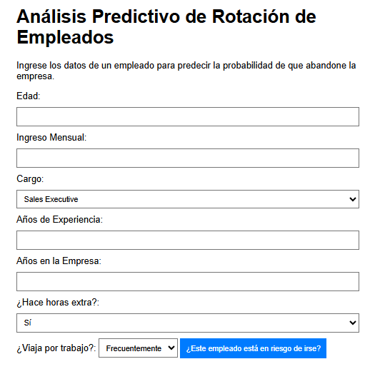
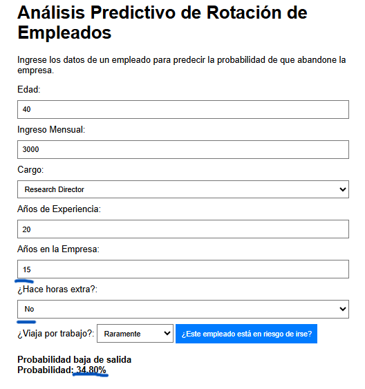
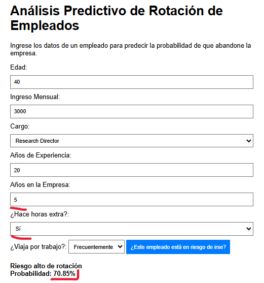

# Proyecto: Predicción de Rotación de Empleados

Este proyecto consiste en el desarrollo de una aplicación web para predecir la probabilidad de que un empleado abandone la empresa.

## 1. Explicación del Problema

La rotación de personal (o "employee churn") es un desafío constante para las empresas, implicando altos costos en reclutamiento, capacitación y pérdida de talento. El objetivo de este proyecto es mitigar este problema mediante un modelo predictivo que analiza las características de un empleado para calcular su probabilidad de salida.

El modelo se basa en el dataset "HR Employee Attrition", disponible en **[Kaggle](https://www.kaggle.com/datasets/patelprashant/employee-attrition)**.

## 2. Cómo fue Entrenado el Modelo

El modelo predictivo es una red neuronal binaria  desarrollada en Python con TensorFlow/Keras y exportada a TensorFlow.js para su uso en el navegador. A continuación se detalla el proceso.

### 2.1. Preprocesamiento de Datos

Para asegurar que el modelo fuera relevante para la aplicación web, se realizó una selección de características basada en las entradas del formulario, utilizando un subconjunto de las "Variables más relevantes":

* `Age` (Edad) 
* `MonthlyIncome` (Ingreso mensual) 
* `JobRole` (Cargo actual) 
* `TotalWorkingYears` (Años totales de experiencia) 
* `YearsAtCompany` (Años en la empresa) 
* `OverTime` (¿Hace horas extra?) 
* `BusinessTravel` (Frecuencia de viajes) 

Las variables categóricas como `JobRole`, `OverTime` y `BusinessTravel`  fueron convertidas a formato numérico mediante la técnica de **one-hot encoding** , la cual crea una nueva columna binaria para cada categoría.

Finalmente, los datos fueron divididos en dos conjuntos:
* **80% para entrenamiento** 
* **20% para prueba y evaluación** 

### 2.2. Arquitectura de la Red Neuronal

Se implementó un modelo secuencial con la siguiente estructura:

1.  **Capa de Entrada**: Del tipo `Dense` con **64 neuronas** y una función de activación **'relu'**. La forma de entrada (`input_shape`) corresponde al número de características después del preprocesamiento.
2.  **Capa Oculta**: Del tipo `Dense` con **32 neuronas** y función de activación **'relu'**.
3.  **Capa de Salida**: Del tipo `Dense` con **1 neurona** y una función de activación **'sigmoid'**. Esta configuración es ideal para problemas de clasificación binaria, ya que la salida es una probabilidad entre 0 y 1.

### 2.3. Compilación y Entrenamiento

El modelo fue compilado con los siguientes parámetros:

* **Optimizador**: `adam` 
* **Función de Pérdida**: `binary_crossentropy` (adecuada para clasificación binaria) 
* **Métrica de Evaluación**: `accuracy` 

El entrenamiento se llevó a cabo con los siguientes hiperparámetros:

* **Épocas**: 50 
* **Tamaño de Lote (Batch Size)**: 16 
* **División de Validación**: 10% (`validation_split=0.1`) de los datos de entrenamiento se usaron para validar el modelo en cada época.

## 3. Capturas de la App

**Formulario de Entrada:**

* 

**Resultado de la Predicción:**

* 
* 